# Movie Recommender


This project is a movie recommender system built with FastAPI, SQLite (*or PostgreSQL*), and Streamlit. <br>
It uses the MovieLens 100k dataset to generate movie recommendations based on user ratings. In addition, the app tracks how many times each recommendation is clicked. You can also add new movies via an API endpoint.

## Table of Contents

- [Dataset](#dataset)
- [Features](#features)
- [Project Structure](#project-structure)
- [Requirements](#requirements)
- [Getting Started](#getting-started)
  - [Running Locally (Without Docker)](#running-locally-without-docker)
  - [Running with Docker & Docker Compose](#running-with-docker--docker-compose)
- [API Endpoints](#api-endpoints)
- [Troubleshooting](#troubleshooting)
- [Images](#images)
- [License](#license)
- [About](#about)


## Dataset
You can find the dataset in this link [https://grouplens.org/datasets/movielens/100k/](https://grouplens.org/datasets/movielens/100k/).
Find out more in the Readme file in the \data\ folder.

## Features

- **Movie Recommendation Engine:** Generate recommendations using cosine similarity.
- **Click Tracking:** Monitor how many times recommendations are clicked.
- **Backend API:** FastAPI provides endpoints for recommendations, click tracking, and adding new movies.
- **Frontend:** A Streamlit app that allows users to enter a movie name, view recommendations, and register clicks.
- **Dockerized Deployment:** Both FastAPI and Streamlit are containerized using Docker and orchestrated with Docker Compose.

## Project Structure

movie-recommender/ <br>
├── backend/ # FastAPI backend <br>
│ ├── myapp/ # FastAPI application package <br>
│ │ ├── init.py <br>
│ │ ├── main.py # FastAPI app <br>
│ │ ├── database.py # Database connection and session setup <br>
│ │ ├── models.py # SQLAlchemy models <br>
│ │ ├── recommender.py # Recommendation engine <br>
│ │ └── schemas.py # Pydantic schemas for validation  <br>
│ ├── sql_load.py # Script to create/load database tables and initial data <br>
│ ├── requirements.txt # Python dependencies for backend <br>
│ └── Dockerfile.backend # Dockerfile for FastAPI backend <br>
├── streamlit_app.py # Streamlit application <br>
├── requirements.txt # Python dependencies for Streamlit app <br>
└── Dockerfile # Dockerfile for Streamlit app <br>
├── docker-compose.yml # Docker Compose file to run both backend and frontend <br>
└


## Requirements

- Docker & Docker Compose
- Python 3.12 if running locally without Docker
- `fastapi` >= 0.115.8
- `numpy` >= 2.2.3
- `pandas` >= 2.2.3
- `psycopg2-binary` >= 2.9.10
- `scikit-learn` >= 1.6.1
- `streamlit` >= 1.42.1
- `uvicorn` >= 0.34.0
- `sqlalchemy` >= 2.0.38

## Getting Started

### Running Locally (Without Docker)

1. **Clone the Repository:**

   ```bash
   git clone https://github.com/gurezende/FastAPI_Movie_Recommender.git
   cd movie-recommender
   ```

2. **Backend Setup:**

Create a virtual environment and install dependencies:
```bash
python -m venv env
source env/bin/activate    # On Windows: .\env\Scripts\activate
pip install --upgrade pip
pip install -r requirements.txt
```

3. **Run FastAPI**
```bash
uvicorn myapp.main:app --reload
```
The FastAPI backend will be available at http://localhost:8000.

4. **Run the Streamlit App:**

Open a new terminal and run Streamlit.

```bash
streamlit run streamlit_app.py
```

The Streamlit app will be available at http://localhost:8501.

### Running with Docker & Docker Compose

1. **Clone the Repository:**

   ```bash
   git clone https://github.com/gurezende/FastAPI_Movie_Recommender.git
   cd movie-recommender
   ```

2. **Build and Run Containers:**

Make sure Docker and Docker Compose are installed, then run:

```bash
docker-compose up --build
```

This command will:

* Build the FastAPI backend image using backend/Dockerfile.
* Build the Streamlit frontend image using streamlit/Dockerfile.
* Start a PostgreSQL container (or use SQLite if configured) for the backend.
* Run the backend container. On first startup, the entrypoint.sh script in the backend will run sql_load.py to initialize the database.
* Run the Streamlit container.

Access the Services:
 
FastAPI Backend: http://localhost:8000 <br>
Streamlit Frontend: http://localhost:8501

## API Endpoints
The FastAPI backend exposes several endpoints. Some key endpoints are:

`GET /`
Returns a welcome message.

`GET /recommend/?movie=<movie_name>`
Returns movie recommendations for the given movie.

`POST /click/?movie_id=<movie_id>`
Registers a click for the specified movie recommendation.

`GET /click_stats/?movie_id=<movie_id>`
Returns the click percentage for the specified movie.

`POST /add_movie/`
Accepts a JSON payload to add a new movie.

You can test these endpoints using the interactive Swagger docs at http://localhost:8000/docs.

## Troubleshooting

* New Movies Not Appearing in Recommendations:
If you add a new movie but it doesn't appear in recommendations, the recommendation engine might be caching data loaded at startup. Consider implementing a refresh mechanism in the backend to reload data after new entries.

* Connection Issues Between Containers:
Ensure that the Streamlit app uses the correct API URL. In `streamlit_app.py`, set:

```python
API_URL = "http://backend:8000" 
```

And confirm the service name in `docker-compose.yml` is set to `backend`.

Module Import Errors:
Make sure your Dockerfile copies all required files and that your working directory and PYTHONPATH are correctly set.

## License
This project is licensed under the MIT License.

## About
This project was created by [Gustavo R. Santos](https://gustavorsantos.me)

## Project Flow

```mermaid
flowchart TB
    subgraph Front-End
        direction TB
        User[/Select a Movie/]
    end

    subgraph Back-End
        direction LR
        Recommender(Recommends<br>Similar Movies) --> Return_Recommendations
    end

    subgraph Saving-to-DB
        direction LR
        Click_Recom[Click on<br>Recommendation] --> |Saves Click<br>Counts to DB| DB[(SQLite DB)]
        style DB fill: #300
    end


    subgraph Add-New-Movie
        direction TB
        Front_End[/Front End<br>Movie Not Listed/] --> |User Add<br>New Movie<br>to DB| DB[(SQLite DB)]
        style DB fill: #300
    end

Front-End --> Back-End --> Saving-to-DB
```



## Images
<table>
  <tr>
    <td width="33%"></td>
    <td width="33%"></td>
    <td width="33%"></td>
  </tr>
</table>